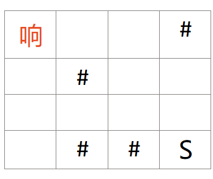
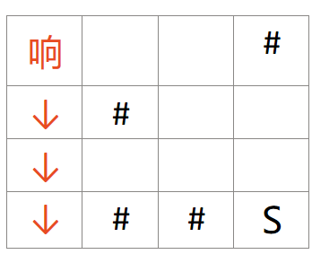
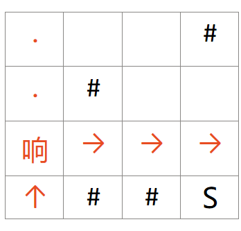
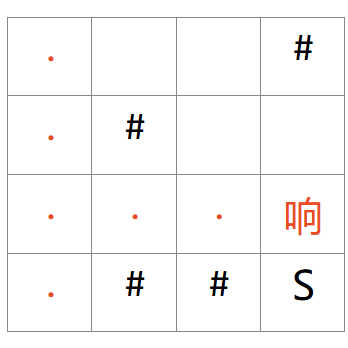
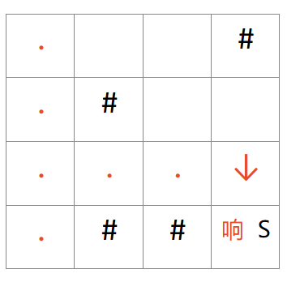

# 基础搜索算法之DFS


## DFS介绍

DFS(Deep First Search)“深度优先搜索”和BFS(Breath First Search)“广度优先搜索”一并为搜索算法中的基础算法。

DFS可描述为：用于遍历或搜索树或图的算法，它会尽可能深地搜索树或图的分支，直到找到目标或者回溯到没有未探索的边为止。

我们通常会将DFS与递归绑定，因为递归的核心思想与DFS的思想是一致的，用递归来实现更容易理解和书写。

## 例子描述

举个例子：Anne Happy中`萩生响`是个天生顶级路痴，为了能到达学校。好胜的她想到了个办法：走过一段距离就用粉笔个画一个标记，然后按照一定规律——对岔路口按照的优先级的选择为`下` > `右` > `上` > `下`选择方向，并用粉笔纪录方向，如果走到了死胡同，那就倒回上一个岔路口，走没有被粉笔标记的路，就这样一直走下去，终会有一条路能走向学校。


下面我们来构建一个简单的城市地图来模拟`响`的思路。

>这是一份简单的地图，红字体的`响`字代表响的位置，而`#`则代表建筑物，无法通行。`S`则代表她的目的地——学校。



响第一步就遇见了岔路口，她对路口的优先级的选择为：`下` > `右` > `上` > `下`。因此，她将一路下行。



然而一路下行下来她却发现了问题，她走到了死胡同，因此她要倒回到最后遇到的岔路口。然后根据优先级，`下` 已经走过了，接下来便往`右`走。



最后，她走到了小镇的边上，不能再往前了，再次按照优先级，她要往`下`走，然后惊奇地发现自己到达了学校。





这就是通过DFS来寻路，让顶级路痴萩生响也能找到去往学校的路，是不是十分神奇。下面就来看看DFS思想在计算机中的实现。

DFS模板（C++）：

```C++
char graph[Max][Max];

int used[Max][Max];  //标记已经走过的路

int px[] = {-1, 0, 1, 0};
int py[] = {0, -1, 0, 1};

void DFS(int x, int y)
{
    if(x==goal_x&&y==goal_y)
    {
        return;
    }
    // 遍历四个方向
    for (int i = 0; i != 4; ++i)
    {
        // 更新方向
        int new_x = x + px[i], new_y = y + py[i];

        // 检验方向
        if(new_x > 0 && new_x <= n && new_y > 0 && new_y <= m && used[new_x][new_y] == 0 && !flag&&graph[new_x][new_y]!='#')
        {
            used[new_x][new_y] = 1; // 将该格子设为走过
            DFS(new_x, new_y); // 使用递归寻找路径
        }
    }
}
```

从模板中我们可以观察到，每次前往新方向是使用递归实现的。同时还使用到另一个表`used[Max][Max]`来标记已经走过的路，这种方法叫去重。

> 那么下面就用一个小题目来熟悉一下DFS的代码实现吧。

## 题目描述

萩生响又一次迷了路。

小镇的布局可以视为一个 $n\times m$ 矩阵，每个位置要么是可通过的路，要么是建筑。响能在道路上`上下左右`移动。

现在响的初始位置为$(1, 1)$ ，请帮响找到一条通往学校$(x, y)$的路径。

## 输入格式

第一行，两个正整数 $n,m$。  

第二行，两个正整数 $x,y$。

接下来 $n$ 行，输入小镇的布局。每行输入一个长为 $m$ 的字符串，`#` 表示建筑，`.` 表示空地。

## 输出格式

仅一行，使用`↑` `↓` `←` `→`组合，输出一条响能到达学校的路径。

## 样例

### 样例输入

```txt
3 5
4 2
.##.#
.#...
...#.
```

### 样例输出

```txt
↓ ↓ → → ↑ →
```

## 例题代码（C++）

```C++
#include <bits/stdc++.h>

using namespace std;

const int Max = 110;

char graph[Max][Max];

int used[Max][Max];  //标记已经走过的路

int n, m, goal_x, goal_y;

int px[] = {0, 1, 0, -1};
int py[] = {1, 0, -1, 0};

vector<string> ans_dir;

void DFS(int x, int y, vector<string> dir)
{
    if (x == goal_x && y == goal_y) // 到达终点的条件
    {
        ans_dir = dir;
        return;
    }
    // 遍历四个方向
    for (int i = 0; i < 4; i++)
    {
        // 更新方向
        int new_x = x + px[i], new_y = y + py[i];

        vector<string> new_dir;

        new_dir = dir;

        if (i == 0) // 将路径载入容器
            new_dir.push_back("↓");
        if (i == 1)
            new_dir.push_back("→");
        if (i == 2)
            new_dir.push_back("↑");
        if (i == 3)
            new_dir.push_back("←");

        // 检验新方向是否可走
        if (new_x > 0 && new_x <= m && new_y > 0 && new_y <= n && used[new_x][new_y] == 0 && graph[new_x][new_y] != '#')
        {
            used[new_x][new_y] = 1;     // 将该格子设为走过
            DFS(new_x, new_y, new_dir); // 递归下去
        }
    }
}

int main()
{
    cin >> n >> m;
    cin>>goal_x;
    cin>>goal_y;

    // 构造地图，注意哪个下表代表是x，哪个下表代表的是y
    for (int i = 1; i <= n; i++)
    {
        for (int j = 1; j <= m; j++)
            cin >> graph[j][i];
    }

    vector<string> dir; // 使用vector容器来存储答案路径

    DFS(1, 1, dir);

    for (int i = 0; i < ans_dir.size(); i++) // 输出结果
    {
        cout << ans_dir[i] << " ";
    }
    cout << endl;

    return 0;
}
```


