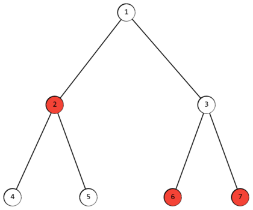

# F. Minimum Maximum Distance

## 题目描述

[题目描述](https://codeforces.com/contest/1881/problem/F)

## 思路



问题转换：本题是求最小的节点到被标记的节点的距离，而这样的节点是存在于两个相距最远的被标记的两节点的路径中央。若不是在这两节点外则就需要走过这两被标记的相距最远距离的节点的距离。而在中间才能平分距离。故问题转化为求图中相距最远的两个被标记的节点。

这样问题就转化为求树的直径，求树的直径有两种方式。第一种是使用`树状DP`，另一种是使用`两次DFS(或BFS)`。

[参考资料](https://oi-wiki.org/graph/tree-diameter/)

这里是使用两次BFS来求树的直径。

## 代码

```C++
#include <bits/stdc++.h>

using namespace std;

const int maxn = 5e+5;

vector<int> a[maxn];
bool vis2[maxn];
int vis[maxn], dis[maxn], pos;
void bfs(int x)
{
    memset(vis, 0, sizeof(vis));
    memset(dis, 0, sizeof(dis));
    pos = x;
    vis[x] = 1, dis[x] = 0;
    queue<int> q;
    q.push(x);
    while (!q.empty())
    {
        int u = q.front();
        q.pop();
        for (int i = 0; i < a[u].size(); i++)
        {
            if (!vis[a[u][i]])
            {
                vis[a[u][i]] = 1;
                dis[a[u][i]] = dis[u] + 1;
                q.push(a[u][i]);
                if (dis[a[u][i]] > dis[pos] && vis2[a[u][i]])
                    pos = a[u][i];
            }
        }
    }
}
void solve()
{
    int n, k, x, y;
    cin >> n >> k;
    for (int i = 1; i <= n; ++i)
    {
        vis2[i] = 0;
        a[i].clear();
    }
    for (int i = 1; i <= k; ++i)
    {
        cin >> x;
        vis2[x] = 1;
        pos = x;
    }
    for (int i = 1; i < n; ++i) // 使用二维数组存入树
    {
        cin >> x >> y;
        a[x].push_back(y);
        a[y].push_back(x);
    }
    if (k == 1)
    {
        printf("%d\n", 0);
        return;
    }
    bfs(pos); // 使用两次BFS来找到直径
    bfs(pos);

    printf("%d\n", (dis[pos] + 1) / 2); // 最小最长路存在与两个相距最远被标记的节点中路
}

int main()
{

    int t;
    cin >> t;
    while (t--)
    {
        solve();
    }
    return 0;
}
```
