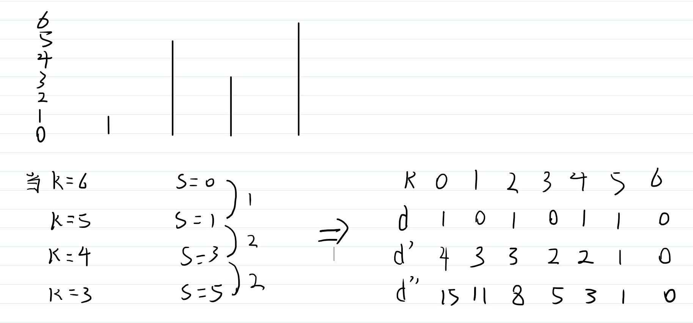

# 又放学辣（进阶）

## 题目描述

[又放学辣（进阶）](https://ac.nowcoder.com/acm/contest/67730/D)

## 思路

使用二分答案来查找最大的合规上限。而对于每次二分的判断，通过使用前缀和、差分的思想来使每次判断的复杂度为O(1)

## 代码

```C++
#include <bits/stdc++.h>

using namespace std;

const int Max = 1e+6 + 5;

int num[Max];
int n, m, k, s;
int t;

int d[Max];

bool check(int x)
{
    if(num[t]>=x)
    {
        return d[x] - (num[t]-x)<=k;
    }
    return d[x]<=k;
}

int bsearch_1(int l, int r) // 使用二分答案查找
{
    while (l < r)
    {
        int mid = l + r >> 1;
        if (check(mid))
            r = mid; 
        else
            l = mid + 1;
    }
    return l;
}

int main()
{

    cin >> n >> m >> k;

    s = n - k;

    for (int i = 1; i <= n; i++)
    {
        int x;
        cin >> x;
        num[x]++;
    }

    // 使用差分和前缀和的思想使check的复杂度位O(1)
    for (int i = m; i > 0; i--)
    {
        d[num[i]-1]++;
    }

    for (int i = n - 1; i >= 0; i--)
    {
        d[i] += d[i + 1];
    }

    for (int i = n - 1; i >= 0; i--)
    {
        d[i] += d[i + 1];
    }

    for (int i = 1; i <= m; i++)
    {
        if (num[i] + k > n)
            cout << -1 << ' ';
        else
        {
            s -= num[i];
            t = i;
            int ans = bsearch_1(0, n);
            cout << ans << ' ';
            s += num[i];
        }
    }

    return 0;
}
```

## 图理解


